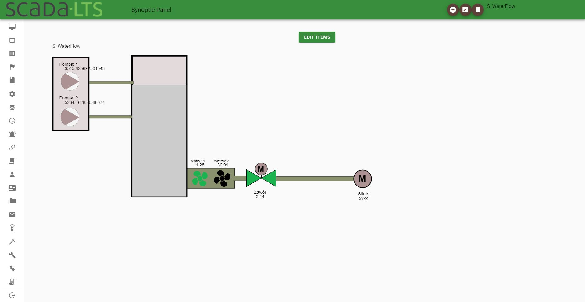

# Synoptic Panel 
**Version:** 0.1.0 Beta \
**Author:** Radek Jajko [rjajko@softq.pl](mailto:rjajko@softq.pl)

Prepare your custom SVG graphic panel and upload it into ScadaLTS Synoptic Panel. Attach 
data points to selected elements and make this panel alive! It is very simple view to monitor
current states of the machines, which can be extended by creating your own components with dedicated logic.

This is Beta feature. It is not fully functional but it provides:
- adding a new synoptic panel with SVG graphic element
- updating a synoptic panel without deleting already configured elements (simple extending)
- deleting the synoptic panel
- attaching datapoints to all SLTS_components
- edition for admin users and read only function for non-admin users

## Getting started:
There are prepared 3 default components: _fan_, _valve_ and _waterlevel_ components. Each of this components
has its own logic and properties. For example waterlevel indicator displays current level of liquid in specified
container. When an attached datapoint value has changed water level is changing. \
To start you have to firstly prepare your panel in vector graphic editor like "inkscape". There are some
rules of creating this panels that must be respected to proper work for this elements.
### Rules:
 When you are preparing SVG panel remember to set ID's for elements with following rules:\
 For SLTS_fan component:
 * ``SLTS_fan_[component_id] - for main element (required)``
 * ``SLTS_fan_[component_id]_background - element wich will changing color``
 * ``SLTS_fan_[component_id]_value - text element to display current data point value``
 
 For SLTS_valve component:
 * ``SLTS_valve_[component_id] - for main element (required)``
 * ``SLTS_valve_[component_id]_background_left - element wich will changing color``
 * ``SLTS_valve_[component_id]_background_right - element wich will changing color``
 * ``SLTS_valve_[component_id]_value - text element to display current data point value``
  
  For SLTS_waterlevel component:
  * ``SLTS_waterlevel_[component_id] - for main element water container (required)``
  * ``SLTS_waterlevel_[component_id]_background - water element rotated in 180 deg wich will changing its height``
  * ``SLTS_waterlevel_[component_id]_value - text element to display current data point value``
  
 In any element without creating a new vue.js component you can use:
 * ``SLTS_[component_name]_[component_id] - for main element (required)``
 * ``SLTS_[component_name]_[component_id]_[background] - to enable background color change``
 * ``SLTS_[component_name]_[component_id]_[label] - to display label from ScadaLTS``
 * ``SLTS_[component_name]_[component_id]_[value] - to display datapoint current value``
 
 ## Creating your own component:
 
 ### Roadmap:
   1. We prepare a SVG graphic with custom component called: **SLTS_ammeter_1**
   2. Then we prepare file Ammeter.vue in custom folder
   3. When all the logic has been coded now we have to import this component to ScadaLTS
   4. Edit CustomComponentsMixin.js - add **Ammeter** to components array and add **'ammeter'** to customComponent array
   5. Compile project using **npm run build** script
   6. Copy dist files to Tomcat\webapps\ScadaLTS\resources\new-ui dir and replace this files.
   7. Open ScadaLTS and upload your SVG graphic in synoptic panel section.
   8. Edit items and check your component.
   
 ### Details:
 Place your vue.js code inside **./custom** directory. Name this file as you want. Remember that your component must
  extend CustomComponentsBase.vue. If it will not extend it any data from your component won't be saved.
  CustomComponentBase provide few simple methods which make it easy to create a new component.
  - **saveData()** - Save component data to ScadaLTS
  - **getDataPointValueXid(xid)** - Get data point last value using Export ID of this data point.
  - **changeComponentColor(component, color)** - Change color of component using componentID reference.
  - **changeComponentText(component, text)** - Change text of text frame component using componentID reference.
  - **rotateComponent(component, ?duration, ?angle, ?loop)**  Rotate component using componentID reference.
  - **finishComponentAnimation(component)** Finish all animations of component.\
  
  Component accessible variables:
  * **componentData** - data which are stored inside Database (configuration of this component)
  * **componentId** - component base id eg: _SLTS_fan_1_
  * **componentEditor** - boolean value. If editor is enabled display template if not run this component logic.
  
  ### When a new component has been created:
  Add your component to import section in __CustomComponentsMixin.js__ file.\
  Inside __components:__ variable add your custom component and then add a name of this component to __customComponent__ array. 
  Remember that name of your component should be the same as it will be specified in SVG graphic.
   